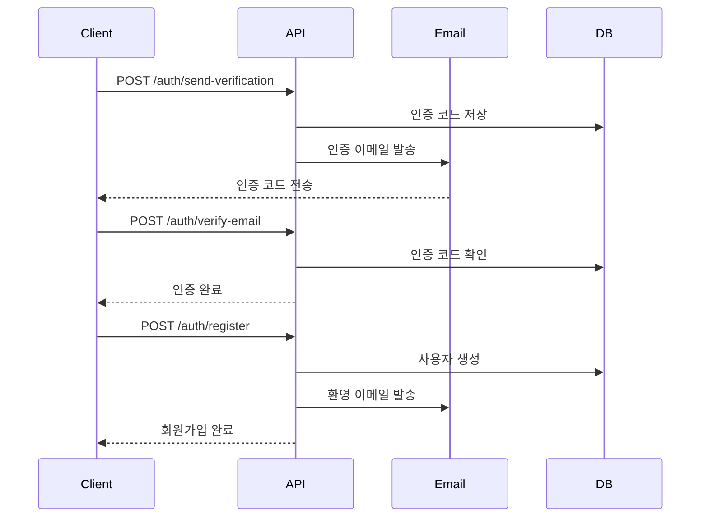

# 이메일 인증 시스템 사용 가이드

## 개요

Weather Flick API는 회원가입 시 이메일 인증을 통해 사용자의 이메일 주소가 유효한지 확인하는 시스템을 제공합니다.

## 설정 방법

### 1. 환경 변수 설정

`.env` 파일에 이메일 설정을 추가하세요:

```env
# 이메일 설정 (Gmail 예시)
MAIL_USERNAME=your-email@gmail.com
MAIL_PASSWORD=your-app-password
MAIL_FROM=your-email@gmail.com
MAIL_PORT=587
MAIL_SERVER=smtp.gmail.com
MAIL_TLS=True
MAIL_SSL=False
MAIL_FROM_NAME=Weather Flick
```

### 2. Gmail 앱 비밀번호 설정

1. Google 계정 설정에서 2단계 인증 활성화
2. 앱 비밀번호 생성
3. 생성된 16자리 비밀번호를 `MAIL_PASSWORD`에 설정

### 3. 패키지 설치

```bash
pip install fastapi-mail
```

## API 엔드포인트

### 1. 이메일 인증 코드 발송

**POST** `/auth/send-verification`

회원가입 전에 이메일 인증 코드를 발송합니다.

**요청 본문:**

```json
{
  "email": "user@example.com",
  "username": "username" // 선택사항
}
```

**응답:**

```json
{
  "message": "Verification code sent successfully",
  "success": true
}
```

### 2. 이메일 인증 코드 확인

**POST** `/auth/verify-email`

발송된 인증 코드를 확인합니다.

**요청 본문:**

```json
{
  "email": "user@example.com",
  "verification_code": "123456"
}
```

**응답:**

```json
{
  "message": "Email verified successfully",
  "success": true
}
```

### 3. 인증 코드 재발송

**POST** `/auth/resend-verification`

인증 코드를 재발송합니다.

**요청 본문:**

```json
{
  "email": "user@example.com"
}
```

**응답:**

```json
{
  "message": "Verification code resent successfully",
  "success": true
}
```

### 4. 회원가입

**POST** `/auth/register`

이메일 인증이 완료된 후 회원가입을 진행합니다.

**요청 본문:**

```json
{
  "email": "user@example.com",
  "username": "username",
  "password": "Password123!"
}
```

**응답:**

```json
{
  "id": 1,
  "email": "user@example.com",
  "username": "username",
  "is_active": true,
  "is_verified": true,
  "role": "user",
  "profile_image": null,
  "bio": null,
  "last_login": null,
  "login_count": 0,
  "created_at": "2024-01-01T00:00:00"
}
```

## 사용 흐름

### 1. 회원가입 프로세스



### 2. 클라이언트 구현 예시

#### React/JavaScript 예시

```javascript
// 1. 이메일 인증 코드 발송
const sendVerification = async (email, username) => {
  const response = await fetch("/auth/send-verification", {
    method: "POST",
    headers: {
      "Content-Type": "application/json",
    },
    body: JSON.stringify({ email, username }),
  });
  return response.json();
};

// 2. 인증 코드 확인
const verifyEmail = async (email, code) => {
  const response = await fetch("/auth/verify-email", {
    method: "POST",
    headers: {
      "Content-Type": "application/json",
    },
    body: JSON.stringify({ email, verification_code: code }),
  });
  return response.json();
};

// 3. 회원가입
const register = async (userData) => {
  const response = await fetch("/auth/register", {
    method: "POST",
    headers: {
      "Content-Type": "application/json",
    },
    body: JSON.stringify(userData),
  });
  return response.json();
};

// 사용 예시
const handleSignup = async () => {
  try {
    // 1단계: 인증 코드 발송
    await sendVerification(email, username);
    setStep("verification");

    // 2단계: 인증 코드 입력 및 확인
    const verificationResult = await verifyEmail(email, verificationCode);
    if (verificationResult.success) {
      setStep("register");
    }

    // 3단계: 회원가입
    const registerResult = await register({
      email,
      username,
      password,
    });

    if (registerResult.id) {
      // 회원가입 성공
      navigate("/login");
    }
  } catch (error) {
    console.error("회원가입 실패:", error);
  }
};
```

#### Python 예시

```python
import requests

# 1. 이메일 인증 코드 발송
def send_verification(email, username=None):
    response = requests.post('http://localhost:8000/auth/send-verification',
                           json={'email': email, 'username': username})
    return response.json()

# 2. 인증 코드 확인
def verify_email(email, code):
    response = requests.post('http://localhost:8000/auth/verify-email',
                           json={'email': email, 'verification_code': code})
    return response.json()

# 3. 회원가입
def register(email, username, password):
    response = requests.post('http://localhost:8000/auth/register',
                           json={'email': email, 'username': username, 'password': password})
    return response.json()

# 사용 예시
def signup_process():
    email = "user@example.com"
    username = "testuser"
    password = "Password123!"

    # 1단계: 인증 코드 발송
    result = send_verification(email, username)
    print("인증 코드 발송:", result)

    # 2단계: 인증 코드 입력 (사용자가 이메일에서 확인)
    verification_code = input("인증 코드를 입력하세요: ")
    verify_result = verify_email(email, verification_code)
    print("인증 결과:", verify_result)

    # 3단계: 회원가입
    if verify_result['success']:
        register_result = register(email, username, password)
        print("회원가입 결과:", register_result)
```

## 보안 고려사항

### 1. 인증 코드 보안

- 6자리 숫자 코드 사용
- 10분 후 자동 만료
- 한 번 사용 후 무효화
- 동일 이메일에 대한 중복 발송 방지

### 2. 이메일 보안

- SMTP TLS 암호화 사용
- 앱 비밀번호 사용 (Gmail)
- 발신자 이메일 검증

### 3. 요청 제한

- 동일 IP에서의 과도한 요청 제한
- 인증 코드 재발송 제한

## 문제 해결

### 1. 이메일 발송 실패

- 이메일 설정 확인
- Gmail 앱 비밀번호 확인
- 방화벽/네트워크 설정 확인

### 2. 인증 코드 만료

- 10분 이내에 인증 코드 입력
- 필요시 재발송 기능 사용

### 3. 이메일 수신 안됨

- 스팸함 확인
- 이메일 주소 정확성 확인
- 발신자 이메일 설정 확인

## 추가 기능

### 1. 이메일 템플릿 커스터마이징

`app/services/email_service.py`에서 HTML 템플릿을 수정할 수 있습니다.

### 2. 인증 코드 형식 변경

6자리 숫자 대신 다른 형식으로 변경 가능합니다.

### 3. 만료 시간 조정

`timedelta(minutes=10)`에서 만료 시간을 조정할 수 있습니다.

### 4. 추가 이메일 서비스 지원

Gmail 외에 다른 이메일 서비스도 지원 가능합니다.
